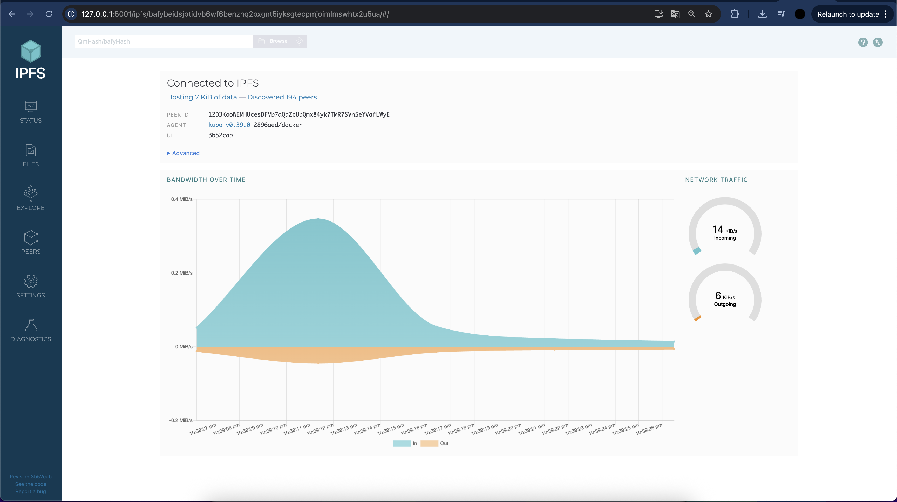
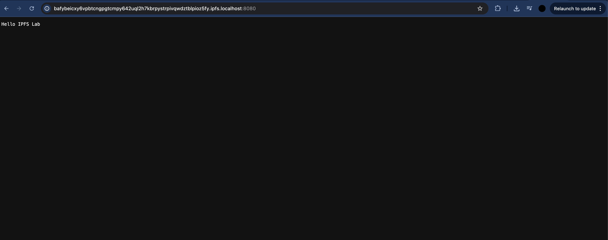
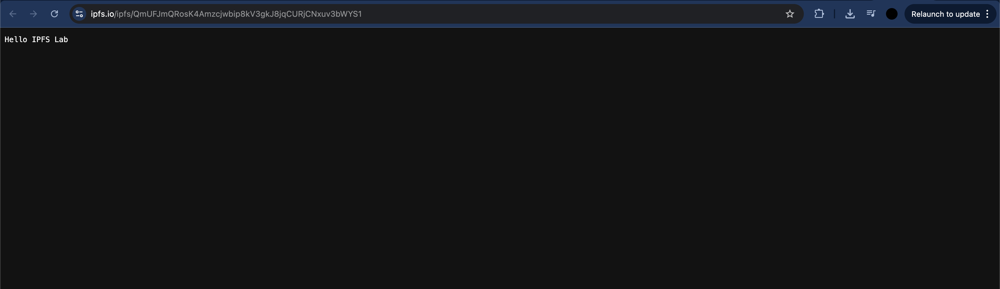
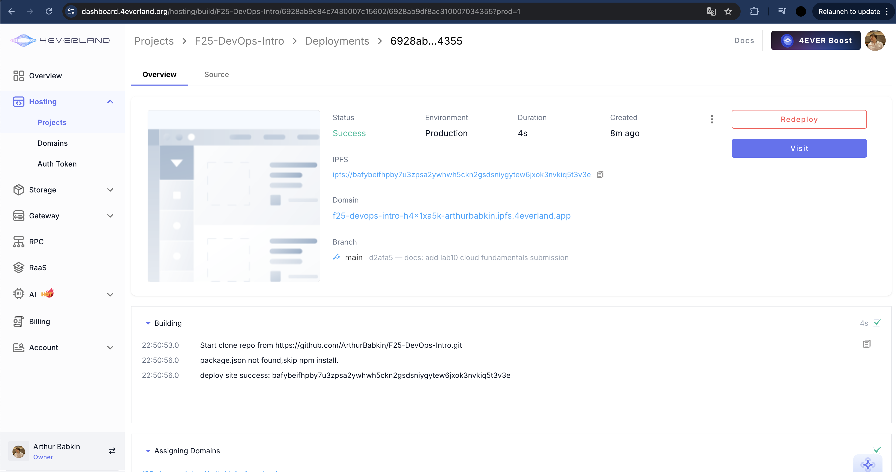
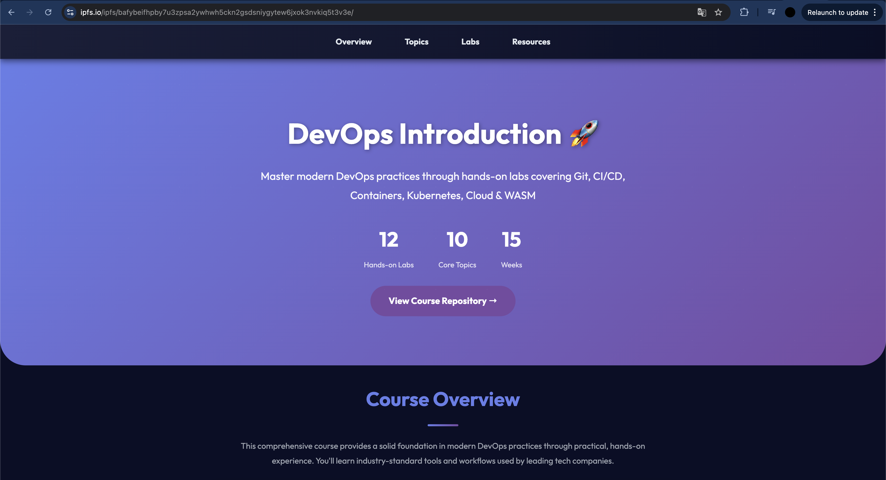

# Lab 11 Submission — Decentralized Web Hosting with IPFS & 4EVERLAND

## Task 1 — Local IPFS Node Setup and File Publishing

### IPFS Node Setup

Started IPFS node in Docker:

```bash
docker run -d --name ipfs_node \
  -v ipfs_staging:/export \
  -v ipfs_data:/data/ipfs \
  -p 4001:4001 -p 8080:8080 -p 5001:5001 \
  ipfs/kubo:latest
```

### Node Status

**Connected Peers:** 194 peers (from Web UI)

**Network Bandwidth Statistics:**
- Incoming: ~14 KiB/s
- Outgoing: ~6 KiB/s



### File Publishing

Created test file and added to IPFS:

```bash
echo "Hello IPFS Lab" > testfile.txt
docker cp testfile.txt ipfs_node:/export/
docker exec ipfs_node ipfs add /export/testfile.txt
```

**CID:** `QmUFJmQRosK4Amzcjwbip8kV3gkJ8jqCURjCNxuv3bWYS1`

### Content Access

**Local Gateway:**
- `http://localhost:8080/ipfs/QmUFJmQRosK4Amzcjwbip8kV3gkJ8jqCURjCNxuv3bWYS1`



**Public Gateways:**
- `https://ipfs.io/ipfs/QmUFJmQRosK4Amzcjwbip8kV3gkJ8jqCURjCNxuv3bWYS1` ✅
- `https://cloudflare-ipfs.com/ipfs/QmUFJmQRosK4Amzcjwbip8kV3gkJ8jqCURjCNxuv3bWYS1`



### Analysis: Content Addressing vs Traditional URLs

**Traditional URLs (location-based):**
- Point to a location: `https://example.com/page.html`
- If server goes down, content is unavailable
- Single point of failure
- Content can change at the same URL

**IPFS Content Addressing (content-based):**
- Points to content via hash: `ipfs://QmUFJmQRosK4Amzcjwbip8kV3gkJ8jqCURjCNxuv3bWYS1`
- Content available as long as at least one node has it
- Same CID always points to same content
- Independent of specific server

**Key difference:** IPFS addresses content by what it is (hash), not where it is (URL). This makes the network resilient to individual node failures.

### Reflection: Advantages and Disadvantages

**Advantages:**
- **Resilience:** Content remains available even if individual nodes fail
- **Censorship resistance:** Harder to block distributed content
- **Versioning:** Same CID always points to identical content
- **Efficiency:** Content duplication reduces load on individual nodes

**Disadvantages:**
- **Propagation delay:** New content may not be immediately available on all gateways (2-5 minutes)
- **Pinning required:** Content can be garbage collected if not pinned
- **Performance:** May be slower than traditional CDNs for popular content
- **Complexity:** Requires understanding new concepts (CID, peers, pinning)

---

## Task 2 — Static Site Deployment with 4EVERLAND

### Project Setup

Created 4EVERLAND project connected to GitHub repository:
- **Repository:** `ArthurBabkin/F25-DevOps-Intro`
- **Branch:** `main`
- **Platform:** IPFS/Filecoin
- **Framework:** Other
- **Output Directory:** `app`

### Deployment Results

**Status:** Success ✅

**IPFS CID:** `bafybeifhpby7u3zpsa2ywhwh5ckn2gsdsniygytew6jxok3nvkiq5t3v3e`

**4EVERLAND Domain:** `f25-devops-intro-h4x1xa5k-arthurbabkin.ipfs.4everland.app`



### Site Access

**Via 4EVERLAND Domain:**
- `https://f25-devops-intro-h4x1xa5k-arthurbabkin.ipfs.4everland.app`


**Via Public IPFS Gateway:**
- `https://ipfs.io/ipfs/bafybeifhpby7u3zpsa2ywhwh5ckn2gsdsniygytew6jxok3nvkiq5t3v3e`



### Analysis: 4EVERLAND vs Manual IPFS Deployment

**4EVERLAND simplifies deployment:**
- **Automation:** No manual `ipfs add` for each file
- **CI/CD integration:** Automatic deployment on GitHub push
- **Pinning:** Automatically pins content for long-term availability
- **Domains:** Provides convenient `.4everland.app` domain
- **Build process:** Handles static site builds

**Manual deployment requires:**
- Running `ipfs add` for each file manually
- Setting up pinning for long-term storage
- Configuring custom domain or using CID only
- Manual update management

**Conclusion:** 4EVERLAND makes IPFS deployment similar to traditional hosting while keeping decentralization benefits.

### Comparison: Traditional Web Hosting vs IPFS Hosting

| Aspect | Traditional Hosting | IPFS Hosting |
|--------|-------------------|--------------|
| **Addressing** | Location-based (URL) | Content-based (CID) |
| **Availability** | Single server dependency | Distributed network |
| **Censorship** | Easy to block | Harder to block |
| **Speed** | Usually faster (CDN) | May be slower |
| **Updates** | Simple (file replacement) | New CID on change |
| **Cost** | Hosting fees | Can be free (with pinning) |
| **Versioning** | Requires separate system | Built-in (different CID = different version) |

**When to use IPFS:**
- Static sites that need censorship resistance
- Content that doesn't change frequently
- Projects where decentralization matters
- Long-term content storage

**When to use traditional hosting:**
- Dynamic applications with server-side logic
- When maximum speed is needed
- When simple updates without URL changes are needed
- When compatibility with older browsers is important
