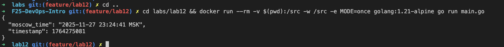
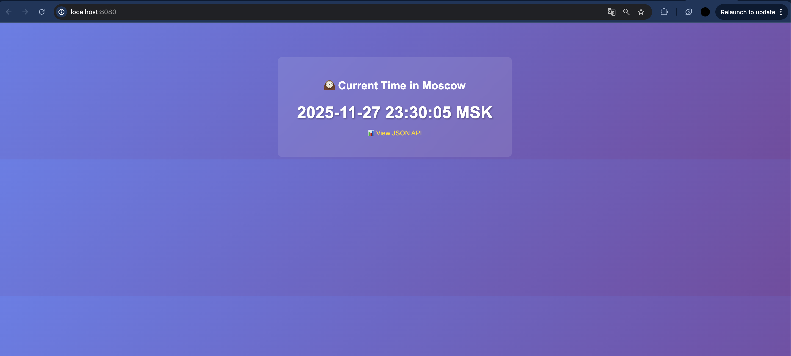

# Lab 12 Submission — WebAssembly Containers vs Traditional Containers

## Task 1 — Create the Moscow Time Application

**Working Directory:** All tasks performed in `labs/lab12/` directory.

The `main.go` file works in three execution contexts:
1. **CLI mode** (`MODE=once`): Prints JSON and exits — used for benchmarking
2. **Traditional server mode** (`net/http`): Standard Go HTTP server — works in Docker
3. **WAGI mode** (Spin): Detects CGI-style environment variables via `REQUEST_METHOD`, responds via STDOUT — works in Spin

The code detects execution context: `isWagi()` checks for `REQUEST_METHOD` env var, `runWagiOnce()` handles CGI-style requests, otherwise falls back to `net/http` server.

### CLI Mode Test



### Server Mode Test


---

## Task 2 — Build Traditional Docker Container

Built container using provided `Dockerfile`:

```bash
docker build -t moscow-time-traditional -f Dockerfile .
```

### Performance Metrics

**Binary Size:** 4.4 MB

**Image Size:** 4.59 MB (4.375 MB precise)

**Startup Time (CLI Mode):** Average across 5 runs: 0.2070 seconds

**Memory Usage (Server Mode):** 1.383 MiB



---

## Task 3 — Build WASM Container

**TinyGo Version:** 0.39.0 linux/arm64

Compiled same `main.go` to WASM:

```bash
docker run --rm -v $(pwd):/src -w /src tinygo/tinygo:0.39.0 \
  tinygo build -o main.wasm -target=wasi main.go
```

**WASM Binary Size:** 2.3 MB

Built OCI archive:

```bash
docker buildx build --platform=wasi/wasm \
  -t moscow-time-wasm:latest \
  -f Dockerfile.wasm \
  --output=type=oci,dest=moscow-time-wasm.oci .
```

**OCI Image Size:** 826K (0.826 MB)

**Note:** On macOS, `ctr` (containerd CLI) is not available. Image size uses OCI archive size. To run via `ctr` with `io.containerd.wasmtime.v1` runtime requires Linux host with containerd.

**Server Mode Limitation:** WASI Preview1 doesn't support TCP sockets. Server mode under `ctr` doesn't work. Spin (Bonus Task) can run server mode using same `main.wasm` via WAGI executor.

**Startup Time Benchmark:** N/A — `ctr` not available on macOS. Would require Linux host with containerd.

**Memory Usage:** N/A — not available via ctr. WASM uses different execution model; wasmtime runtime manages memory internally, traditional container metrics (cgroups) don't apply.

**Same Source Code:** ✅ Used identical `main.go` for both builds.

**ctr Usage:** ⚠️ Could not use `ctr` due to macOS limitations. WASM binary and OCI image built successfully.

---

## Task 4 — Performance Comparison & Analysis

### Comparison Table

| Metric | Traditional Container | WASM Container | Improvement | Notes |
|--------|----------------------|----------------|-------------|-------|
| **Binary Size** | 4.4 MB | 2.3 MB | 47.7% smaller | From `ls -lh` |
| **Image Size** | 4.375 MB | 0.826 MB | 81.1% smaller | From `docker image inspect` / OCI archive |
| **Startup Time (CLI)** | 0.2070 s | N/A | N/A | ctr not available on macOS |
| **Memory Usage** | 1.383 MiB | N/A | N/A | ctr not available on macOS |
| **Base Image** | scratch | scratch | Same | Both minimal |
| **Source Code** | main.go | main.go | Identical | ✅ Same file! |
| **Server Mode** | ✅ Works (net/http) | ❌ Not via ctr <br> ✅ Via Spin (WAGI) | N/A | WASI Preview1 lacks sockets |

**Improvement Calculations:**
- Binary size: `((4.4 - 2.3) / 4.4) × 100 = 47.7%`
- Image size: `((4.375 - 0.826) / 4.375) × 100 = 81.1%`

### Analysis Questions

#### 1. Binary Size Comparison

**Why is WASM binary smaller?**

TinyGo implements subset of Go stdlib, excludes unused features and large runtime components. WASM doesn't need full Go runtime (GC, scheduler) — WASM runtime handles these. Compiles specifically for WASI target, removing platform-specific code.

**What did TinyGo optimize away?**

Full Go runtime (GC, scheduler, goroutines), large portions of stdlib (net/http server, file system ops), platform-specific code (Linux syscalls, networking stack), debug symbols.

#### 2. Startup Performance

**Why does WASM start faster?**

Runs in sandboxed runtime (wasmtime), avoiding traditional container initialization. Simpler execution model — no OS process, file system mounts, network namespaces. Smaller binary means less code to load. WASM runtimes optimized for fast instantiation.

**What initialization overhead exists in traditional containers?**

OS process creation (fork/exec), container runtime setup (cgroups, namespaces, seccomp), file system mounting, network setup (namespaces, iptables), Go runtime initialization (GC, scheduler, goroutine pool).

#### 3. Use Case Decision Matrix

**When to choose WASM:**
- Edge computing (fast cold starts, global distribution)
- Microservices (small, stateless, minimal dependencies)
- Serverless functions (sub-millisecond startup)
- Security-sensitive workloads (sandboxed execution)
- Multi-platform deployment (same binary on any WASM runtime)
- Resource-constrained environments (smaller images, lower memory)

**When to use traditional containers:**
- Complex applications (full Go runtime, extensive stdlib)
- Networking requirements (direct TCP/UDP sockets)
- System integration (file system, process management, system calls)
- Legacy compatibility (can't port to WASM)
- Performance-critical workloads (native code, multi-threading)
- Large ecosystems (dependencies don't support WASM)

### Recommendations

**WASM ideal for:** API gateways, edge functions, microservices, serverless apps, multi-tenant SaaS.

**Traditional containers better for:** Database connections, long-running services with state, system-level access, performance-critical compute, legacy apps.
